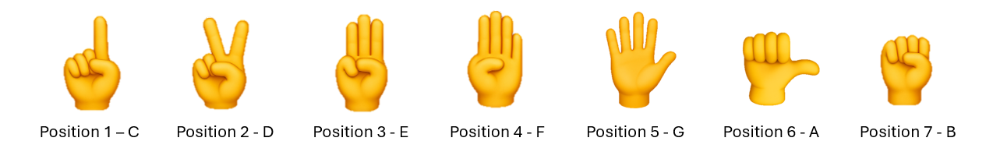

# Finger Jams: A Virtual Instrument using MediaPipe and NN-Classifier

This project utilizes a neural network classifier to classify 7 hand gestures from live MediaPipe and OpenCV inputs. Each combination of hand gestures and handness is mapped to one of 42 notes in the C major scale.

---

## Table of Contents
- [Overview](#overview)
- [Background](#background)
- [Features](#features)
- [Data Pipeline](#data-pipeline)
- [Model Architecture](#model-architecture)
- [Example Usage](#example-usage)
- [What I Learned](#what-i-learned)
- [Future Work](#future-work)

---
  
## Overview
Using MediaPipe, a prebuilt hand-recognizer, and OpenCV for camera input, I manually collected over 10,000 hand gesture samples using my HandData class.
From there, I built a custom pipeline to preprocess the data, engineered additional features to distinguish similar gestures, and trained a neural network classifier. Using the left hand to control the octaves and the right hand to control the 7 notes in a C Major scale, I connected my preprocessing pipeline
to a live input and mapped the processed data to audio outputs. In the end, I created a novel design for next-generation music creation!

MediaPipe hand landmarks:

---
## Background
Ever since I started playing violin at 6 years old, I've always loved creating and practicing music. Whether it's practicing the Bruch Concerto in G minor for the thousandth time or jazzifying Star Wars music off the top of my head,
music is where we can explore how deep our creativity can go. I believe that everyone should have access to create music, but often it can be inconvenient and pricey to own an instrument. 
So I decided to create a virtual instrument - an instrument that can be played anywhere, anytime, completely hassle-free! All it requires is a free set of hands and your imagination. 

---

## Features
- MediaPipe for hand recognition
- OpenCV for live input at 60 fps
- HandData class used to collect, delete, and store saved landmarks
- Custom Data pipeline to normalize position, scale, alignment, rotation, and handness
- Feature engineering for angles between fingers
- Deep Neural Network trained on 65 features (21 hand landmarks * 3D coordinates + 2 angle features) to classify 7 gestures
- Refined model through dropout, early stopping, mini-batch gradient descent

---

## Data Pipeline
### Collection
Data collection takes place in `data_collection.py`. This script utilized two classes: HandTracker and HandData
- HandTracker
  - This class provided the necessary methods to process an image input, collect the hand landmark coordinates, and draw the landmarks on the image
- HandData
  - This class provided the necessary tools to collect and save the coordinates. Utilities included during a capture session include setting the gesture label for a session, adding/deleting coordinates, and saving the data to a unique file name
- How to use `data_collection.py`
  1) Before running the script, ensure you have set the proper "GESTURE_LABEL" and "FILE_PATH"
  2) OpenCV will launch on start and will open up another tab with the live video feed
  3) Hit Enter to save a coordinate for the right hand
     - Hand must be fully in the screen to register
     - The left hand cannot be captured
     - Two hands cannot be captured
  4) Hit Backspace to delete the last captured coordinate
  5) Hit ESC to exit the program.

---

### Processing
Data processing takes place with the `normalize_utils.py` script. See `edda.ipynb` for my full reasoning for each processing step. Essentially, to train and also predict with the model, we need a way to process the data so that it always comes back consistently, regardless of which hand it is, what position it is in the screen, how big the hand is, or how rotated it is. We want to recognize the hand gesture solely and ignore all other factors. 

**1) Raw data**  
Here is what a single sample looks like, consisting of 21 hand landmarks, each with 3D coordinates.

**2) Normalizing the position**  
The origin by default starts at the top left of an image. So our first step of normalization is to set the origin to the wrist, which is landmark 0.  

**3) Normalizing the scale**  
We need to remove any dependencies on the size of the hand. We set the distance between landmark 0 and 9 to be fixed at a length of 1  

**4) Normalizing the alignment**  
The hand so far can be rotated freely in the 3D coordinate space. Let's align it with the positive y-axis:  

**5) Normalizing the rotation**  
Finally, the hand can freely rotate around the y-axis. Let's set the thumb to be aligned with the X-Y plane.  

---

### Feature Engineering  
My model had an extremely hard time distinguishing between similar gestures. For example, position 6 (closed fist with thumb extended) and position 7 (a completely closed fist), or holding up 4 fingers vs 5. So I computed the angle between two vectors: the thumb vector and the vector from the wrist to the base of the middle finger. Using the sine and cosine of the angle as two additional features, my model was able to distinguish these gestures much better.

---

## Model Architecture  
###  Architecture
- **Input Layer**: 65 features (from `X`)
- **Hidden Layer 1**:  
  - Dense (64 units) with **ReLU activation**  
  - Dropout (30%) to reduce overfitting  
- **Hidden Layer 2**:  
  - Dense (32 units) with **ReLU activation**  
  - Dropout (30%)  
- **Output Layer**:  
  - Dense (8 units) with **Softmax activation** for probability distribution across 8 classes  

### Compilation
- **Optimizer**: Adam (adaptive learning rate)  
- **Loss Function**: Sparse Categorical Crossentropy (for integer-encoded labels)  
- **Metrics**: Accuracy  

### Training
- **Train/Test Split**: 80/20 using `train_test_split` (random state = 42 for reproducibility)  
- **Batch Size**: 40  
- **Epochs**: Up to 100  
- **Early Stopping**: Stops training if validation loss doesn’t improve for 5 epochs 

### Evaluation
- **Cross-Entropy Loss Curve**: Plots training and validation loss across epochs  
- **Accuracy Curve**: Plots training and validation accuracy across epochs  

---

## Example Usage
### How to play Finger Jams
Creating music on Finger Jams is simple: the left hand controls the octaves, and the right hand controls the notes. The seventh position on the left hand will silence any note from playing. 

---

## What I learned
This was a really fun project that combined my love for math, coding, AI, and music! Here are some of the skills I learned and applied:
- As this was my first major project in Python, I learned how to properly incorporate different principles I learned from my C++ class, such as encapsulation and inheritance.
- I also utilized my knowledge of linear algebra to provide many different transformations of the 21x3 matrix for each sample.
- During the summer, I took a deep neural network course through Coursera, and I was able to leverage many of the concepts I learned
- Having over 12 years of experience playing music, I had to create an instrumental scheme that would make it easy to switch between notes.
- Because this project involved audio and live input, this was very interactive and extremely fun to create!

---

## Future Work
Improvements:
- Optimize the speed of camera startup
- Collect more data
- Increased processing time of input to output

Different features to include:  
- Add different majors
- Incorporate different sound outputs
- Have songs to play along 
- Turn it into a mobile app 

